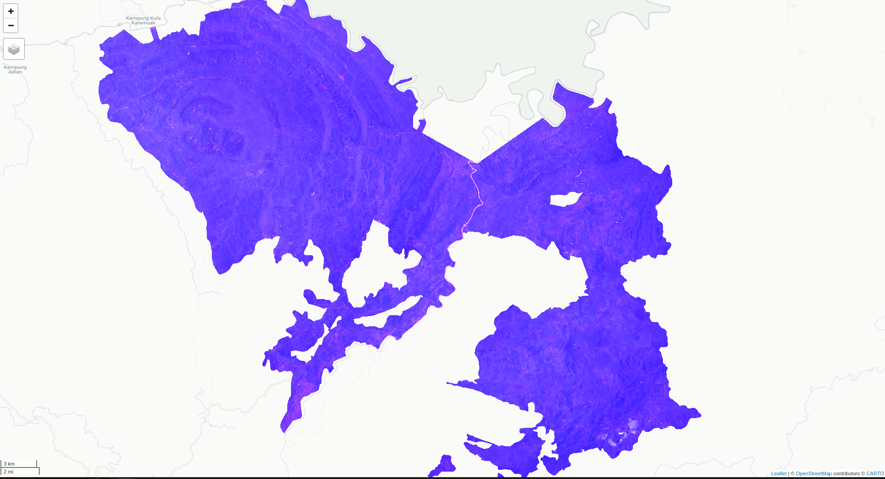

<!-- README.md is generated from README.Rmd. Please edit that file -->

```{r, include = FALSE}
knitr::opts_chunk$set(
  collapse = TRUE,
  comment = "#>",
  fig.path = "man/figures/README-",
  out.width = "100%"
)
```

# peer

<!-- badges: start -->

[](https://lifecycle.r-lib.org/articles/stages.html#experimental)

<!-- badges: end -->

The goal of peerm is to provide easy access to useful [{rgee}](https://r-spatial.github.io/rgee/) functions - like composites etc.

## Installation

You can install the development version of peerm from [GitHub](https://github.com/) with:

``` r
# install.packages("remotes")
remotes::install_github("Permian-Global-Research/peer")
```

## Example

Quick example creating a False Colour Composite from Landsat 8 data.

```{r example, warn=FALSE, eval=FALSE}
library(rgee)
ee_Initialize(quiet=TRUE)
library(peer)
library(sf)

# get Landsat 8 collection from date range and cloud cover filters.
comp2021 <- l8_collect(aoi=kuamut,
                       start.date = '2021-01-01',
                       end.date= '2021-12-31',
                       min.cloud=50)|>
  l8_mask_clouds()|>   #function mask clouds
  l8_terrain_correct(aoi.sf = kuamut) # function to run terrain correction

x_img <- comp2021$
  map(l8_add_evi)$ # function to add EVI 
  map(l8_add_ndvi)$ # function to add NDVI
  median()

# x_img <- l8_mask_clouds(x)$ # landsat 8 cloud and shadow mask.
#   median()


vizParams <- list(
  bands = c('B3', 'B4', 'B5'),
  min= 0,
  max= 1000,
  gamma= c(1.1, 0.95, 0.7)
)

aoi_cent <- st_centroid(kuamut) %>%
  st_coordinates()

Map$setCenter(lon = aoi_cent[1], lat = aoi_cent[2], zoom = 10)
m<-Map$addLayer(x_img$clip(plt.aoi), vizParams, 'FC-composite-2021')+
```


